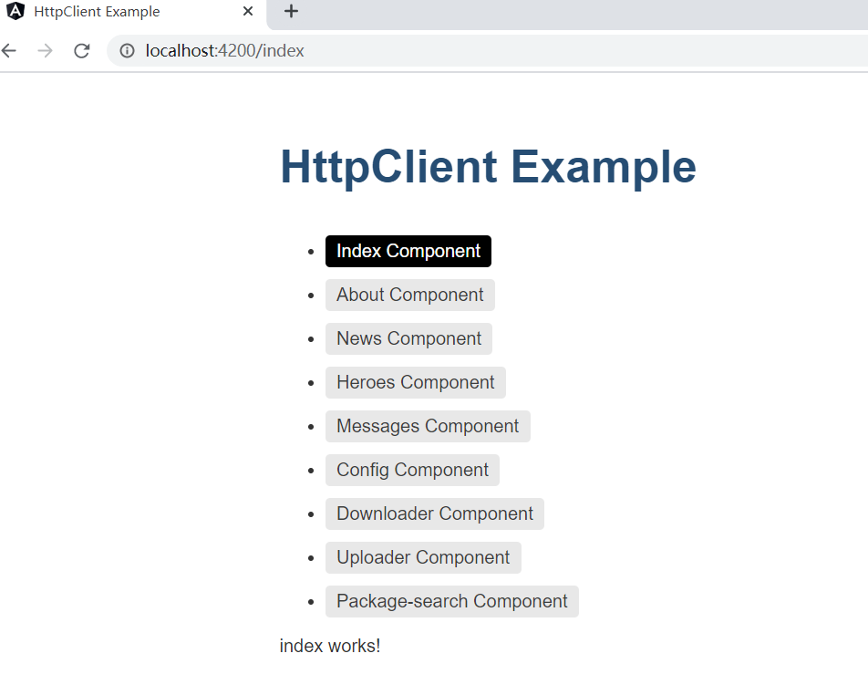
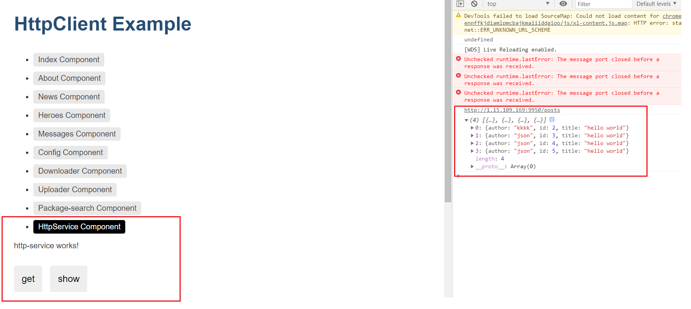
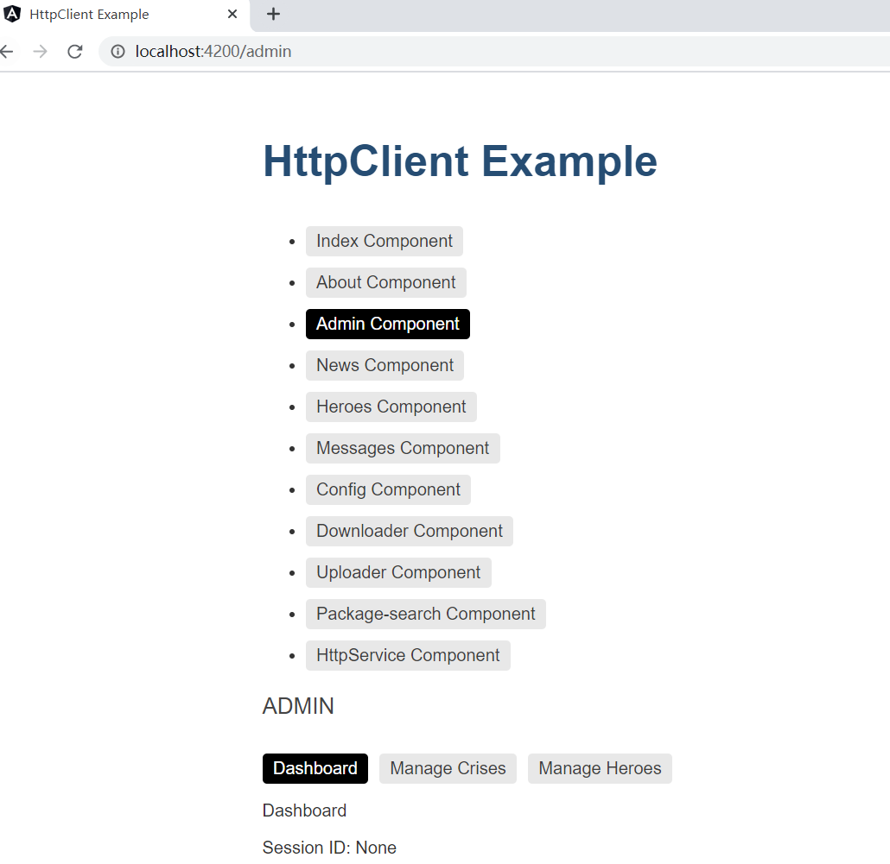
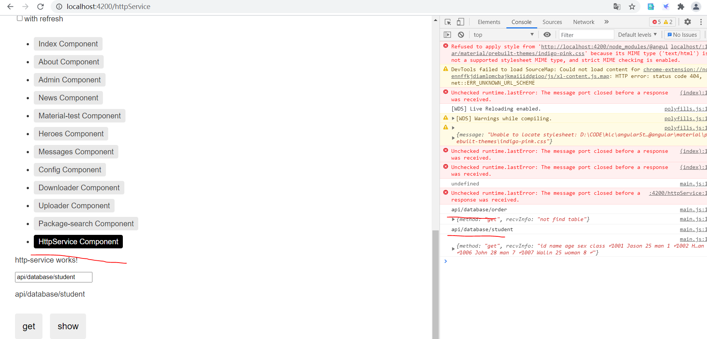

# Angular 前端学习项目

**v1.1 程序：**

以[http.zip](https://angular.cn/guide/http)的demo为基础，添加了route导航的内容，完成各个页面的切换。



**v1.2 程序：**

加入了HttpService服务，用来获取服务端的数据并进行显示，http://1.15.109.169:9950/posts 为请求的接口，下面的json为返回的结果。

临时注释了，index.ts里面httpInterceptorProviders，拦截器的代码，因为拦截器需要强制https访问等。且服务端也做了修改,以解决异域访问的问题。

```c++
//解决has been blocked by CORS policy: No 'Access-Control-Allow-Origin' 
//header is present on the requested resource.
header += "Access-Control-Allow-Origin: *\r\n";
```



**v1.3 程序：**

引入惰性加载特性模块。Admin Component,后续考虑引入导航树结构，便于界面的扩展。

```
默认情况下，NgModule 都是急性加载的，也就是说它会在应用加载时尽快加载，所有模块都是如此，无论是否立即要用。对于带有很多路由的大型应用，考虑使用惰性加载 —— 一种按需加载 NgModule 的模式。惰性加载可以减小初始包的尺寸，从而减少加载时间。
```



**v1.4 程序：**

针对HttpService服务，加入了对服务器端数据的访问接口，通过输入api/database/student，调用http服务，转向用get方法获取http://1.15.109.169:9950/database/student 的数据。



其中，代理文件proxy.config.json如下：

将/api的调用转向http://1.15.109.169:9950

```json
{
  "/api2": {
     "target": "http://1.15.109.169:9950/api2"
  },
  "/api": {
    "target": "http://1.15.109.169:9950",
    "secure": false,
    "changeOrigin": true,
    "pathRewrite": {"^/api":""}
 }
}
```

