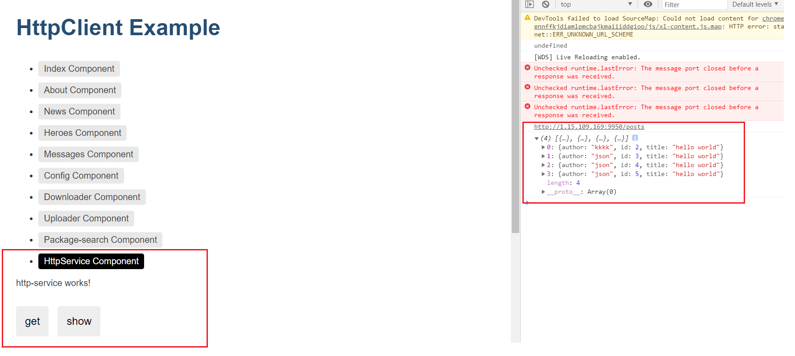

# Angular 前端学习项目


v1.1：

以[http.zip](https://angular.cn/guide/http)的demo为基础，添加了route导航的内容，完成各个页面的切换。


v1.2 程序：

加入了HttpService服务，用来获取服务端的数据并进行显示，http://1.15.109.169:9950/posts 为请求的接口，下面的json为返回的结果。

临时注释了，index.ts里面httpInterceptorProviders，拦截器的代码，因为拦截器需要强制https访问等。且服务端也做了修改,以解决异域访问的问题。

```c++
//解决has been blocked by CORS policy: No 'Access-Control-Allow-Origin' 
//header is present on the requested resource.
header += "Access-Control-Allow-Origin: *\r\n";
```


