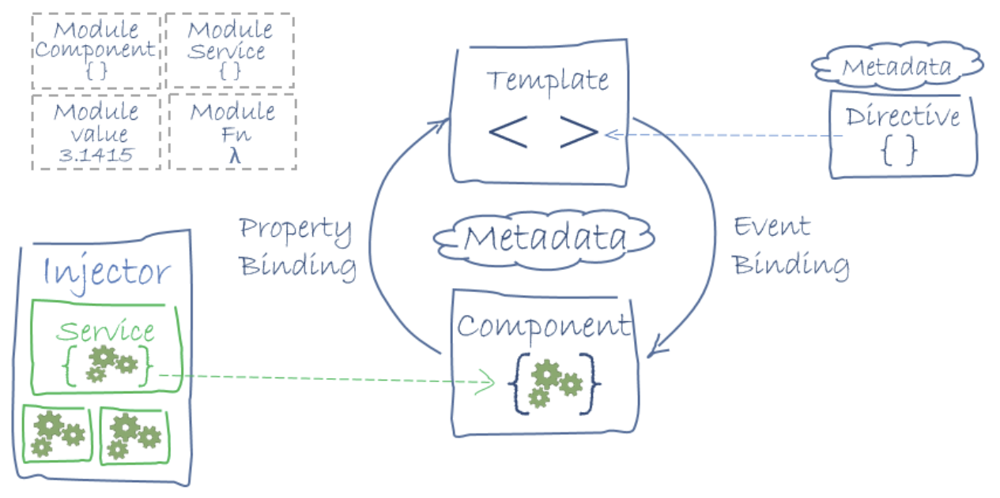
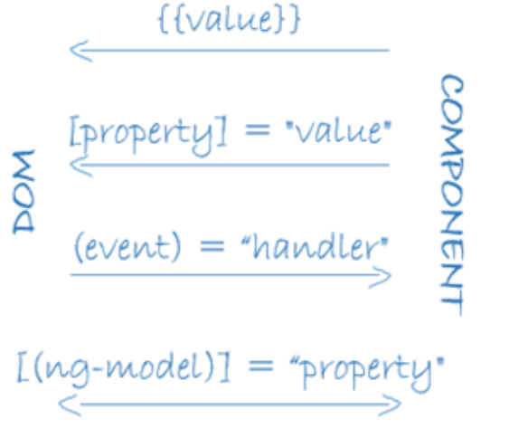

# Angular 2 架构

## 参考资料

* [Angular 2 架构](https://www.runoob.com/angularjs2/angularjs2-architecture.html)
* [angular 中文网站](https://angular.cn/)

---

## 组成

Angular 2 应用程序应用主要由以下 8 个部分组成：

1. 模块 (Modules)
2. 组件 (Components)
3. 模板 (Templates)
4. 元数据 (Metadata)
5. 数据绑定 (Data Binding)
6. 指令 (Directives)
7. 服务 (Services)
8. 依赖注入 (Dependency Injection)

下图展示了每个部分是如何相互工作的：

图中的模板 (Templates)是由 Angular 扩展的 HTML 语法组成，组件 (Components)类用来管理这些模板，应用逻辑部分通过服务 (Services)来完成，然后在模块中打包服务与组件，最后通过引导根模块来启动应用。



---

## 模块 (Modules)

模块由一块代码组成，可用于执行一个简单的任务。Angular应用是由模块化的，它有自己的模块系统：NgModules。
每个Angular应该至少要有一个模块(根模块)，一般可以命名为：AppModule。

Angular模块是一个`带有 @NgModule 装饰器的类，它接收一个用来描述模块属性的元数据对象`。

@NgModule 重要的属性如下：

* declarations - 用来放组件、指令、管道的声明。

* exports - 声明的子集，可用于其它模块中的组件模板 。

* imports - 用来导入外部模块。

* providers - 服务的创建者。本模块把它们加入全局的服务表中，让它们在应用中的任何部分都可被访问到。

* bootstrap - 应用的主视图，称为根组件，它是所有其它应用视图的宿主。只有根模块需要设置 bootstrap 属性中。

根模块app.module.ts示例如下:
```ts
import { NgModule } from '@angular/core';
import { BrowserModule } from '@angular/platform-browser';

import { AppRoutingModule } from './app-routing.module';
import { AppComponent } from './app.component';

@NgModule({
  declarations: [
    AppComponent
  ],
  imports: [
    BrowserModule,
    AppRoutingModule
  ],
  providers: [],
  bootstrap: [AppComponent]
})
export class AppModule { }
```

---

## 组件(Components)

组件是一个模板的控制类用于处理应用和逻辑页面的视图部分。

* 组件是构成 Angular 应用的基础和核心，可用于整个应用程序中。

* 组件知道如何渲染自己及配置依赖注入。

* 组件通过一些由属性和方法组成的 API 与视图交互。

创建 Angular 组件的方法有三步：

1. 从 @angular/core 中引入 Component 修饰器
2. 建立一个普通的类，并用 @Component 修饰它
3. 在 @Component 中，设置 selector 自定义标签，以及 template 模板

语法实现:
```ts
ng g component component/news  
```

---

## 模板(Templates)

Angular模板的默认语言就是HTML。

我们可以通过使用模板来定义组件的视图来告诉 Angular 如何显示组件。以下是一个简单是实例：

```html
<div>
网站地址 : {{site}}
</div>
```

---

## 元数据(Metadata)

元数据告诉Angular如何处理一个类。

* 考虑以下情况，我们有一个组件叫作Component，它是一个类，直到我们告诉 Angular这是一个组件为止。

* 你可以把元数据附加到这个类上来告诉 Angular, Component 是一个组件。

* 在TypeScript中，我们`用装饰器 (decorator) 来附加元数据`。

示例：
```ts
@Component({
  selector: 'app-news',
  templateUrl: './news.component.html',
  styleUrls: ['./news.component.css']
})
```

@Component 装饰器能接受一个配置对象，并把紧随其后的类标记成了组件类。因为一个ts文件里可以写多个Component：

Angular 会基于这些信息创建和展示组件及其视图。

@Component 中的配置项说明：

* selector - 一个 css 选择器，它告诉Angular在父级 HTML中寻找一个<app-news> 标签，然后创建该组件，并插入此标签中。

* templateUrl - 组件 HTML 模板的地址。

* directives - 一个数组，包含 此 模板需要依赖的组件或指令。

* providers - 一个数组，包含组件所依赖的服务所需要的依赖注入提供者。

---

## 数据绑定(Data binding)

数据绑定为应用程序提供了一种简单而一致的方法来显示数据以及数据交互，它是管理应用程序里面数值的一种机制。

通过这种机制，可以从HTML里面取值和赋值，使得数据的读写，数据的持久化操作变得更加简单快捷。

如图所示，数据绑定的语法有四种形式。每种形式都有一个方向——从 DOM 来、到 DOM 去、双向，就像图中的箭头所示意的。



备注：DOM 是 Document Object Model（文档对象模型）的缩写
```
DOM 是 W3C（万维网联盟）的标准。

DOM 定义了访问 HTML 和 XML 文档的标准：

“W3C 文档对象模型 （DOM） 是中立于平台和语言的接口，它允许程序和脚本动态地访问和更新文档的内容、结构和样式。”
W3C DOM 标准被分为 3 个不同的部分：

核心 DOM - 针对任何结构化文档的标准模型
XML DOM - 针对 XML 文档的标准模型
HTML DOM - 针对 HTML 文档的标准模型
```

**插值** : 在 HTML 标签中显示组件值。

```html
<h1>
{{title}}

</h1>
```

**属性绑定**: 把元素的属性设置为组件中属性的值。

```html

```

**事件绑定** : 在组件方法名被点击时触发。

```html
<button (click)="onSave()">保存</button>
```

**双向绑定**: 使用Angular里的NgModel指令可以更便捷的进行双向绑定。

```html
<input [value]="currentUser.firstName"
       (input)="currentUser.firstName=$event.target.value" >
```

---

## 指令（Directives）

Angular模板是动态的 。当 Angular 渲染它们时，它会根据指令对 DOM 进行修改。指令是一个带有"指令元数据"的类。在 TypeScript 中，要通过 @Directive 装饰器把元数据附加到类上。

在Angular中包含以下三种类型的指令：

* 属性指令：以元素的属性形式来使用的指令。
* 结构指令：用来改变DOM树的结构
* 组件：作为指令的一个重要子类，组件本质上可以看作是一个带有模板的指令。

```html
<li *ngFor="let site of sites"></li>
<site-detail *ngIf="selectedSite"></site-detail>
```

* *ngFor 告诉 Angular 为 sites 列表中的每个项生成一个 <li> 标签。

* *ngIf 表示只有在选择的项存在时，才会包含 SiteDetail 组件。

---

## 服务(Services)

Angular2中的服务是封装了某一特定功能，并且可以通过注入的方式供他人使用的独立模块。

服务分为很多种，包括：值、函数，以及应用所需的特性。

例如，多个组件中出现了重复代码时，把重复代码提取到服务中实现代码复用。

以下是几种常见的服务：

* 日志服务
* 数据服务
* 消息总线
* 应用程序配置

以下实例是一个日志服务，用于把日志记录到浏览器的控制台

```ts
export class Logger {
  log(msg: any)   { console.log(msg); }
  error(msg: any) { console.error(msg); }
  warn(msg: any)  { console.warn(msg); }
}
```

---

## 依赖注入(Dependency Injection)

Angular 能通过查看构造函数的参数类型，来得知组件需要哪些服务。 例如， SiteListComponent 组件的构造函数需要一个 SiteService:

ts
```
constructor(private service: SiteService) { }
```

当 Angular 创建组件时，会首先为组件所需的服务找一个注入器（ Injector ） 。

注入器是一个维护服务实例的容器，存放着以前创建的实例。

如果容器中还没有所请求的服务实例，注入器就会创建一个服务实例，并且添加到容器中，然后把这个服务返回给 Angular 。

当所有的服务都被解析完并返回时， Angular 会以这些服务为参数去调用组件的构造函数。 这就是依赖注入 。


