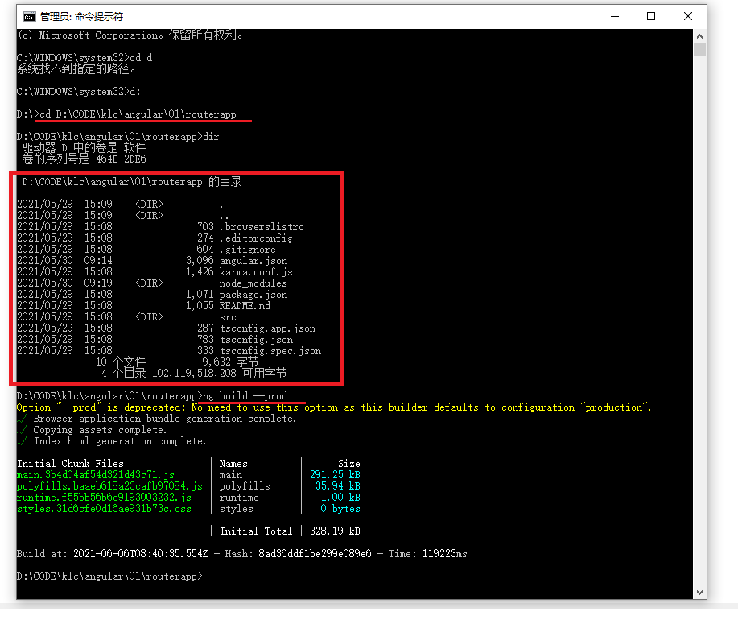
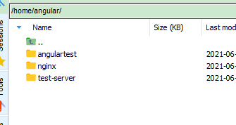

# 如何将angular项目部署到服务器上

## 参考资料

* [docker+nginx部署angular项目](https://blog.csdn.net/weixin_43269840/article/details/104921174)
* [利用docker中的nginx镜像部署angular项目](https://www.cnblogs.com/MyUniverse/p/11288977.html)

---

## 打包项目

1. 在命令行进入项目所在位置



2. 使用ng build --prod进行打包，在该路径下就会生成一个dist文件夹

3. 将dist文件夹上传到云服务器

4. 对dist里面的文件进行赋权

```
cd /home/angular/angulartest/dist/routerapp/
chmod 777 *
```

---

## 配置nginx并运行容器



```
.
|-- angulartest  ——————打包项目dist的存放目录
|   `-- dist
|       `-- routerapp
|           |-- 3rdpartylicenses.txt
|           |-- favicon.ico
|           |-- index.html
|           |-- main.3b4d04af54d321d43c71.js
|           |-- polyfills.baaeb618a23cafb97084.js
|           |-- runtime.f55bb56b6c9193003232.js
|           `-- styles.31d6cfe0d16ae931b73c.css
|-- nginx   ———————— nginx 配置的路径
|   |-- conf
|   |   `-- nginx.conf
|   |-- conf.d
|   |   `-- default.conf
|   `-- log
`-- test-server     ———————— 后端服务器的文件，暂未使用

```

1. 在dist的上一级目录中新建nginx文件夹进行挂载

2. 在nginx/conf.d中新建配置文件default.conf并将下面的内容粘贴进去

```bash
 server {
    listen       4300; # nginx监听端口
    server_name 1.15.109.169; #若有域名则将localhost替换为域名

    #charset koi8-r;
    #access_log  /var/log/nginx/host.access.log  main;

    location /api/ {
        proxy_pass http://1.15.109.169:8848/;
    }

    location / {
        #proxy_pass http://127.0.0.1:8848/$1;
        #proxy_method POST;
        #proxy_set_header X-Real-IP $remote_addr;
        #proxy_set_header REMOTE-HOST $remote_addr;
        #proxy_set_header X-Forwarded-For $proxy_add_x_forwarded_for;
        root   /usr/share/nginx/html; #test项目路径
        index index.html index.html; #默认起始页
        try_files $uri $uri/ /index.html; #spa前端项目路由配置
    }
 
    #error_page  404              /404.html;

    # redirect server error pages to the static page /50x.html
    #
    error_page   500 502 503 504  /50x.html;
    location = /50x.html {
        root   /usr/share/nginx/html;
    }

}
```
3. 在nginx/conf下新建nginx.conf并将下面内容粘贴进去

```bash
worker_processes  1;
  
error_log  /var/log/nginx/error.log warn;
pid        /var/run/nginx.pid;


events {
    worker_connections  1024;
}


http {
    include       /etc/nginx/mime.types;
    default_type  application/octet-stream;

    log_format  main  '$remote_addr - $remote_user [$time_local] "$request" '
                      '$status $body_bytes_sent "$http_referer" '
                      '"$http_user_agent" "$http_x_forwarded_for"';

    access_log  /var/log/nginx/access.log  main;

    sendfile        on;
    #tcp_nopush     on;

    keepalive_timeout  65;

    gzip  on;
    gzip_min_length 1k;
    gzip_buffers 4 16k;
    gzip_comp_level 3;
    gzip_types text/plain text/css application/xml application/javascript application/x-javascript text/javascript;
    include /etc/nginx/conf.d/*.conf;
}
```
4. 执行docker run命令进行启动容器

```bash
docker run -p 4300:4300 --name angulartest --privileged=true -v /home/angular/nginx/conf.d/default.conf:/etc/nginx/conf.d/default.conf -v /home/angular/nginx/conf/nginx.conf:/etc/nginx/nginx.conf -v /home/angular/angulartest/dist/routerapp:/usr/share/nginx/html -d nginx
```
